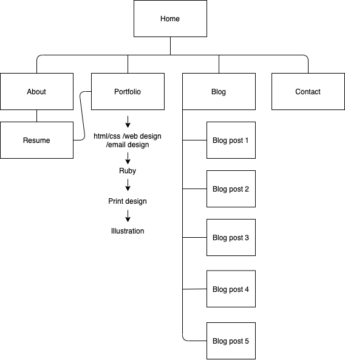
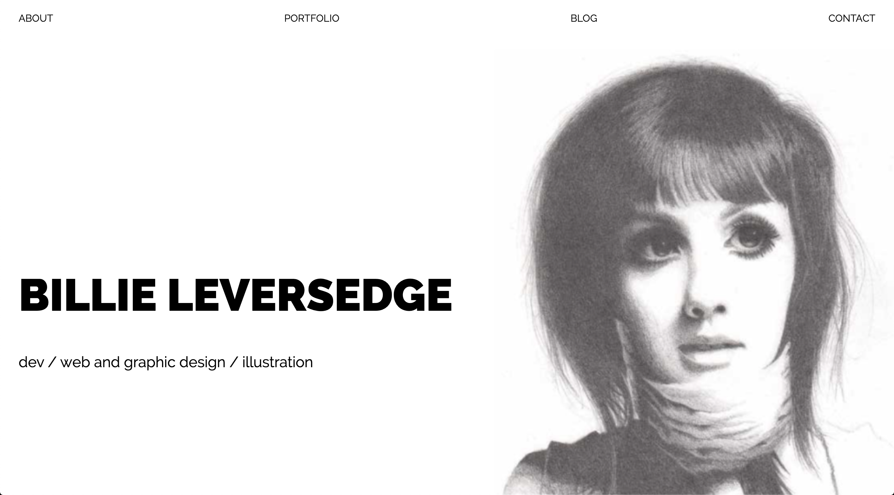
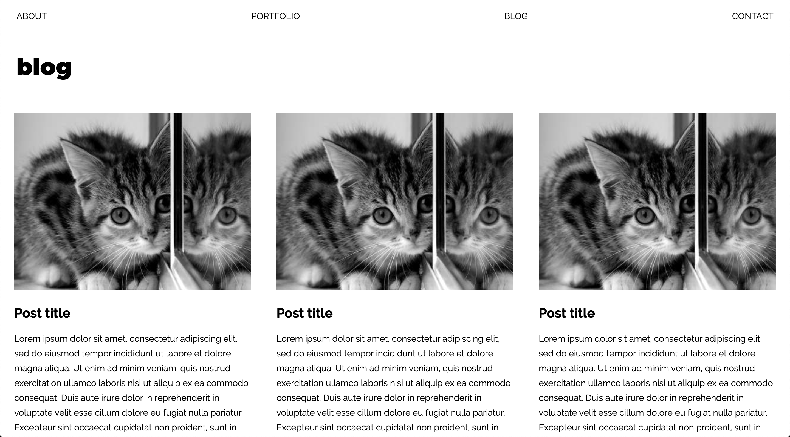
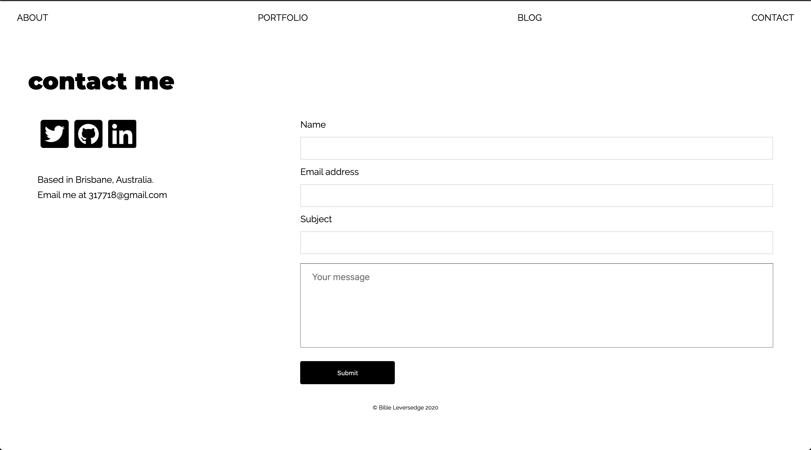

Site link:
<https://billieleversedge.netlify.app/>

Github repo:
<https://github.com/317718/T1A2-portfolio>

Description:

The purpose of this site is to demonstrate my skills as a developer and designer, and provide potential clients and employers with information about my abilities, qualifications and work history.

The features of the site include a scrolling portfolio of my past work (yet to be implemented), a resume page with a link to a downloadable version of my resume and portfolio, a blog page with some sample posts, and a page with contact information and a form for users to get in touch with me.

The target audience for this site is anyone who is looking to work with a front-end or full-stack dev with a strong background in design. 

The tech stack includes Ruby, HTML, CSS and SASS.

Sitemap:

Screenshots:  
 
 
 

